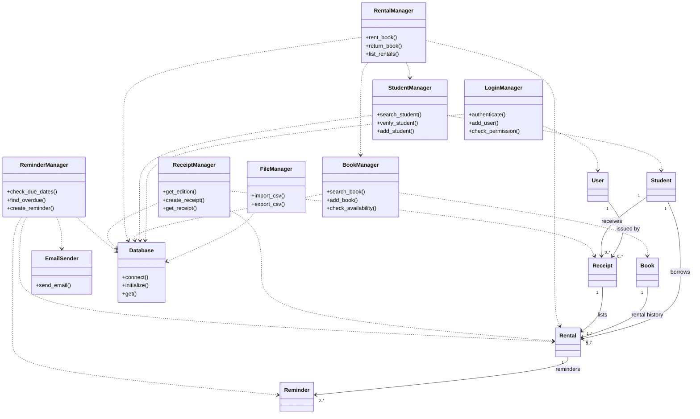

# Simplified 15-Class UML

```mermaid
classDiagram
    User "1" --> "0..*" Receipt : issued by
    Student "1" --> "0..*" Rental : borrows
    Book "1" --> "0..*" Rental : rental history
    Student "1" --> "0..*" Receipt : receives
    Receipt "1" --> "1..*" Rental : lists
    Rental "1" --> "0..*" Reminder : reminders

    LoginManager ..> User
    StudentManager ..> Student
    BookManager ..> Book
    RentalManager ..> Rental
    RentalManager ..> StudentManager
    RentalManager ..> BookManager
    ReceiptManager ..> Receipt
    ReceiptManager ..> Rental
    ReminderManager ..> Reminder
    ReminderManager ..> Rental
    ReminderManager ..> EmailSender
    FileManager ..> Database
    LoginManager ..> Database
    StudentManager ..> Database
    BookManager ..> Database
    RentalManager ..> Database
    ReceiptManager ..> Database
    ReminderManager ..> Database

    class LoginManager {
      +authenticate()
      +add_user()
      +check_permission()
    }
    class StudentManager {
      +search_student()
      +verify_student()
      +add_student()
    }
    class BookManager {
      +search_book()
      +add_book()
      +check_availability()
    }
    class RentalManager {
      +rent_book()
      +return_book()
      +list_rentals()
    }
    class ReceiptManager {
      +get_edition()
      +create_receipt()
      +get_receipt()
    }
    class ReminderManager {
      +check_due_dates()
      +find_overdue()
      +create_reminder()
    }
    class Database {
      +connect()
      +initialize()
      +get()
    }
    class EmailSender {
      +send_email()
    }
    class FileManager {
      +import_csv()
      +export_csv()
    }
```

This is the simplified code-oriented UML. The original SDS listed 26 components; align the SDS before claiming the diagrams are identical.
